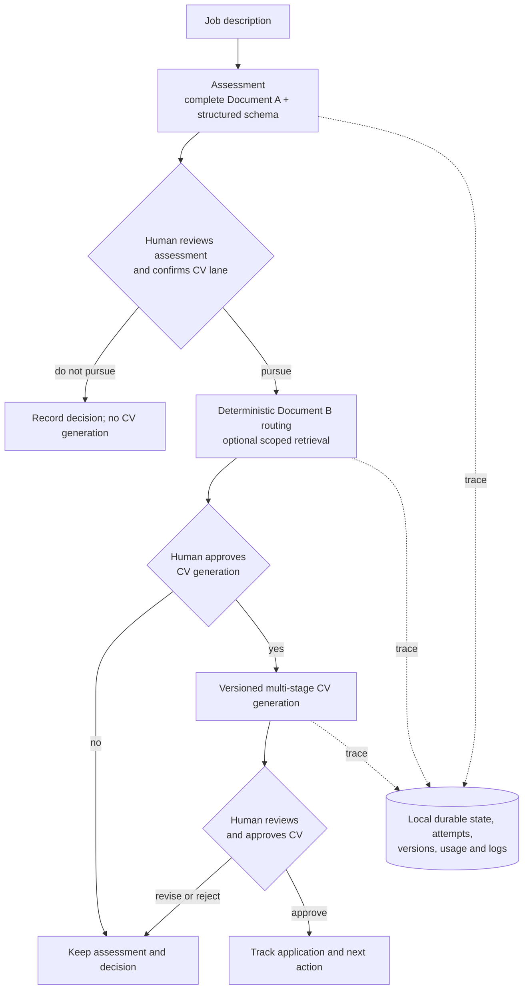

# Job Application Copilot

[](https://github.com/danielBrule/job-application-copilot/actions/workflows/ci.yml)
[](https://creativecommons.org/licenses/by/4.0/)

> A real, evidence-grounded career workflow—not a mass-application generator. The challenge is
> not only getting a model to write a convincing CV; it is ensuring that every recommendation and claim
> remains grounded in approved evidence, follows explicit human decisions, and can be reviewed.

I’m [Daniel Brule](https://www.linkedin.com/in/danielbrule/), a data and AI delivery leader building
governed GenAI systems hands-on. I built this project for a practical reason: to make my own job
search more deliberate. It is also a working example of how to build a copilot around a real,
high-stakes use case where fluent output is not enough.

[LinkedIn](https://www.linkedin.com/in/danielbrule/) · [GitHub](https://github.com/danielBrule/) ·
[Portfolio case study](docs/portfolio-case-study.md) · [Five-minute demo](docs/demo.md)

## What this proves

This repository demonstrates that I can:

- turn a real business workflow into a bounded, usable GenAI copilot;
- put deterministic controls around probabilistic model output: structured schemas, local
  validation, evidence constraints and deterministic content routing;
- keep a person accountable at meaningful decision gates, including CV generation and approval;
- build for reliable local operation with durable task state, bounded workers, recovery and
  traceability;
- keep sensitive career data local by default while making model calls explicit; and
- apply practical engineering discipline through typed Python, migrations, tests, linting and CI.

This is a **production-minded, local-first copilot** with a deliberately limited deployment scope.
It is a working implementation, not a mock-up. It is not represented as a hosted, multi-tenant
production service; see [Scope and status](#scope-and-status) for that boundary.

## Contents

- [How to use this repository](#how-to-use-this-repository)
- [How a job becomes an evidence-grounded CV](#how-a-job-becomes-an-evidence-grounded-cv)
- [Workflow steps](#workflow-steps)
- [Scope and status](#scope-and-status)
- [Repository map](#repository-map)
- [Documentation](#documentation)

## How to use this repository

Choose the path that matches why you are here:

| You have | Read or run | You will get |
| --- | --- | --- |
| 3 minutes | This README | The product thesis, workflow and delivery boundary. |
| 10 minutes | [Portfolio case study](docs/portfolio-case-study.md) | The engineering choices, controls and trade-offs. |
| 15 minutes | [Architecture](docs/architecture.md) and [OpenAI pipeline](docs/openai-pipeline.md) | The application boundaries and exact evidence-control model. |
| A local environment | [Local operations guide](docs/local-operations.md) | Setup, configuration, checks and safe local operation. |
| A product walkthrough | [Five-minute demo](docs/demo.md) | A repeatable demo with fictional data only. |

For a fast local start:

```powershell
.\dev.ps1 env
.\dev.ps1 ui
```

The application uses private local data and requires an OpenAI API key only for explicit model
actions. See [local setup and configuration](docs/local-operations.md#setup-and-configuration)
before running it.

## How a job becomes an evidence-grounded CV

The workflow separates **what is true** from **how it is positioned**.

- **Document A — Career Strategy, Evidence & Job Assessment Guide** is the authority for job-fit
  logic, factual evidence, confidence, gaps and overclaiming constraints. Every assessment receives
  the complete active Document A.
- **Document B — CV Generation & Positioning Guide** contains approved CV material and positioning
  guidance. It cannot create evidence or override Document A. The user-confirmed CV lane selects
  its mandatory sections deterministically; scoped retrieval can only add supplementary material.



The full rationale and contracts are documented in the [requirements](docs/requirements.md),
[Document B retrieval guide](docs/document-b-retrieval.md) and
[routing manifest guide](docs/document-b-routing-manifest.md).

## Workflow steps

1. **Prepare controlled assets.** Configure versioned Documents A and B, prompts, templates and
   the Document B routing manifest in Settings.
2. **Capture an opportunity.** Add a job description and its context locally; nothing is assessed
   or submitted automatically.
3. **Assess the role.** The application supplies complete Document A and the full job description
   to a structured assessment workflow, retaining the evidence anchors, gaps and constraints.
4. **Choose the narrative.** The assessment recommends a lane; the user confirms or changes it
   before any Document B material is selected.
5. **Generate deliberately.** The user explicitly approves CV generation. The pipeline uses only
   the authorised Document B material, selected references and persisted stage inputs.
6. **Review and decide.** The user edits the DOCX in Word and explicitly approves it before
   recording application status, contacts, interviews and next actions.

See the [screen specification](docs/screens.md), [data model](docs/data-model.md) and
[pipeline detail](docs/openai-pipeline.md) for the implementation-level view.

## Scope and status

### Implemented in this repository

- Local Streamlit application for job capture, assessment review, CV review, settings and
  background-run visibility.
- SQLite persistence with SQLAlchemy and Alembic migrations.
- Versioned private reference assets, prompts, templates and Document B routing configuration.
- Explicit OpenAI file/vector-store workflows for canonical reference assets.
- Separate local worker, bounded concurrency, durable task attempts, interruption recovery and
  guarded retry actions.
- Structured model outputs validated locally with Pydantic, version traceability and token/duration
  usage recording.
- Private rotating logs with secret-redaction safeguards.
- GitHub Actions quality checks: pytest, branch-coverage reporting, Ruff lint/format and mypy.

### Deliberately out of scope

- Automatic application submission, employer-portal automation, bulk outreach or application-volume
  optimisation.
- A hosted multi-user service, authentication, tenant isolation or a cloud database.
- Managed backups, production alerting, on-call support, formal incident response or a release
  promotion process.
- A browser-based Word editor, automatic approval of a CV, or claims that a model can establish
  factual truth without human review.

The [case study](docs/portfolio-case-study.md#what-would-be-needed-for-a-hosted-production-service)
sets out the additional work required for a hosted production service. The
[security and privacy statement](SECURITY.md) defines the local data boundary.

## Repository map

```text
README.md                     Portfolio overview and repository map
docs/                         Detailed product, architecture and operating documentation
  README.md                   Documentation index
  local-operations.md         Setup, configuration, checks and local operation
  portfolio-case-study.md     Engineering decisions and delivery boundary
  demo.md                     Fictional-data demo and screenshot checklist
src/job_application_copilot/  Streamlit UI, domain, services, repositories and OpenAI adapter
tests/                        Automated tests
templates/                    Committed non-private templates and prompt assets
examples/portfolio-demo/      Clearly fictional public demo source material
.github/workflows/            Continuous-integration workflow
dev.ps1                       Local developer command entry point
```

## Documentation

Start with the [documentation index](docs/README.md). The detailed documents are intentionally
separate from this README so a reviewer can choose depth without losing the implementation evidence.

Key references:

- [Architecture](docs/architecture.md)
- [OpenAI pipeline](docs/openai-pipeline.md)
- [Requirements](docs/requirements.md)
- [Screens](docs/screens.md)
- [Data model](docs/data-model.md)
- [Local operations](docs/local-operations.md)
- [Portfolio case study](docs/portfolio-case-study.md)
- [Demo walkthrough](docs/demo.md)
- [Security and privacy](SECURITY.md)
- [Architecture decisions](docs/decisions/)

## Public demo assets

The public demo uses only fictional material. The source is in
[`examples/portfolio-demo`](examples/portfolio-demo/). Screenshot capture instructions are in
[docs/demo.md](docs/demo.md#screenshot-checklist). The linked images are intentionally generic
placeholders; replace them with redacted fictional demo captures before publishing the repository.

- [Dashboard placeholder](docs/images/01-dashboard.png)
- [Jobs placeholder](docs/images/02-jobs.png)
- [Assessment placeholder](docs/images/03-assessment.png)
- [CV-generation placeholder](docs/images/04-cv-generation.png)
- [Settings placeholder](docs/images/05-settings.png)
- [Background-runs placeholder](docs/images/06-background-runs.png)
