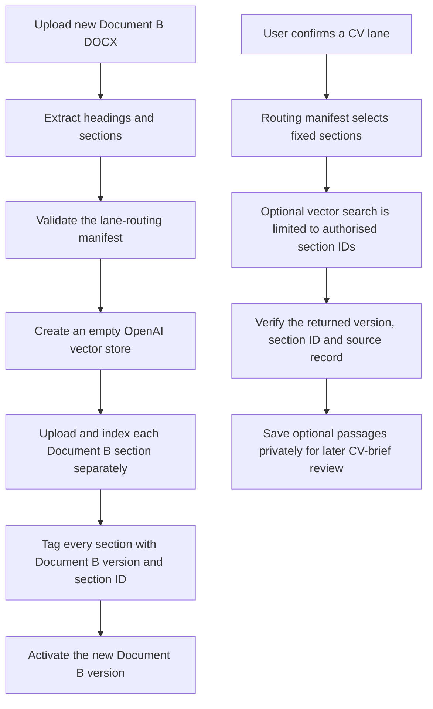

# Document B section-aware retrieval

## Purpose

Document B is the approved library for CV positioning and wording. It is not a source of career
evidence: Document A remains the authority for facts, confidence and overclaiming constraints.

The application uses Document B in two different ways:

- **Direct context:** fixed sections selected deterministically for the user-confirmed CV lane.
- **Vector search:** optional passages found only within the bullet-library sections that the lane
  authorises.

## Simple flow

## What is and is not vectorised

The complete Document B DOCX is retained as the authoritative private document, but it is **not**
attached to the vector store. For every future Document B version, only separately derived section
text sources are indexed.

Each indexed source carries:

- the exact Document B version;
- the stable local section ID; and
- a local source-record entry with the content hash and OpenAI file ID.

This lets the application prove that an optional returned passage came from a section permitted by
the selected lane.

## What happens for one job

1. Assessment recommends a lane using Document A only.
2. The user confirms or changes that lane.
3. The routing manifest selects mandatory local Document B sections.
4. The application may vector-search only the lane's authorised bullet-library sections.
5. Unverified, wrong-version or unauthorised results are rejected.
6. Returned optional passages are stored privately for later human review in the CV brief.

Vector search does not choose the lane, create evidence, choose final CV bullets or write the CV.
